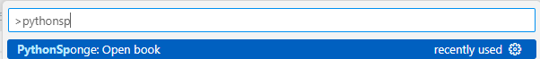
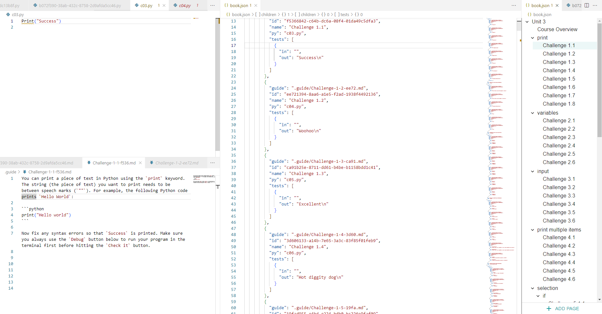

# Python Sponge book editor

**Create your own Python Sponge challenge books from within VSCode**

## Python Sponge
[Python Sponge](https://www.pythonsponge.com/) is an open-source project that enables portable, installation-free, serverless Python programming in the browser, for education. The code base is available on [Github](https://github.com/gdenes355/python-frontend). 

Students can make use of the hundreds of challenges we have authored for PyshonSponge.com.

Teachers can author their own challenge books, which they can then either host statically (e.g. on github pages or Google Drive), or distribute as zip files. For more information, see [https://www.pythonsponge.com/teacher.html](https://www.pythonsponge.com/teacher.html).

Why do you need this VSCode extension then? If as a teacher you have VSCode and Python, you might find it easier to author your challenges in VSCode. Most of the challenges are described using `.py` and `.md` files, which VSCode supports natively. However, editing and creating the `book.json` file, which describes the challenge set, can be tricky.

## Features

Once you have navigated to a folder that contains a `book.json` file, you can open the book using the `PythonSponge: Open book` command. This will rearrange your window to allocate panels for the `.py`, `.md` editors as well as the `json` and `visual` editor for your book.

**If you haven't got a `book.json` file yet, the command will create a very simple one for you**.

## Requirements

You need to have an internet connection to use the visual editor.

Building the package required [UUID](https://www.uuidgenerator.net/dev-corner/typescript).

## Extension Settings

There are no settings at the moment.

## Known Issues

Books with duplicate IDs can result in the visual editor freezing. Please reload the visual editor.

## Release Notes

### 0.0.1

Initial release of the extension

### 0.0.3

Integration with the automated test runner against sample solutions

